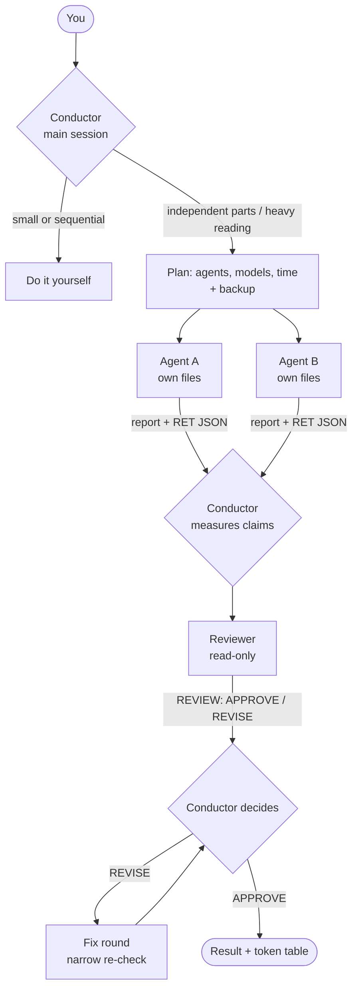

<div align="center">

# 🎼 orkestra

**The conductor doesn't play.**

A sub-agent orchestration skill for **Claude Code** and **Codex**. Your main session becomes
the conductor: it splits the work, writes tight briefs, reads short reports and decides.
Sub-agents do the heavy reading, writing and measuring, and an independent reviewer checks
every result.

[](LICENSE)


[](https://github.com/Azkhar/orkestra/actions/workflows/tests.yml)

[Türkçe](README.tr.md) · [Install with one prompt](#-install-with-one-prompt) · [How it works](#-how-it-works) · [Settings](#%EF%B8%8F-settings)

</div>

---

## Why

A single agent that reads everything fills its own context, starts forgetting, and burns your
usage limit on work a cheaper model could do. Spawning twenty agents is not the answer either:
most jobs don't need it, and every sub-agent starts cold.

orkestra is the middle path, distilled from real runs:

- **Default: do it yourself.** Delegate only when there are independent parts, heavy reading,
  or a need for an independent check.
- **Briefs with fences.** Each agent gets its own files, a do-not-touch list, measurable
  acceptance criteria and a fixed return format ending in one line of JSON.
- **Nobody approves their own work.** A read-only reviewer measures against the criteria and
  returns `APPROVE` or `REVISE`. The conductor still makes the call.
- **Agents die; work doesn't.** Back up first, measure the damage, resume instead of restart.
- **Your limits decide the models.** A profile (`lean`, `balanced`, `generous`) maps each kind
  of work to a fast or strong tier. Claude model aliases follow new releases automatically.

## 🚀 Install with one prompt

Open Claude Code or Codex in your project and say:

```
Install https://github.com/Azkhar/orkestra in this project.
```

The agent reads [INSTALL.md](INSTALL.md), asks you three questions (global or project,
conductor mode, how much usage headroom you have), shows a dry run, then installs.

<details>
<summary><b>Manual install</b></summary>

```powershell
git clone https://github.com/Azkhar/orkestra.git
cd orkestra

# Windows (PowerShell 7; for Windows PowerShell 5.1: powershell -ExecutionPolicy Bypass -File .\install.ps1 ...)
.\install.ps1 -Scope Global -Profile balanced                   # skill for all projects
.\install.ps1 -Scope Project -Path D:\my-app -Always -BlockOnly # conductor mode in one project
.\install.ps1 -DryRun                                           # show, write nothing
```

```bash
# macOS / Linux / Git Bash  (flags accept "--scope project" or "--scope=project")
./install.sh --scope global --profile balanced
./install.sh --scope project --path ~/my-app --always --block-only
./install.sh --dry-run
```

| Flag | What it does |
|---|---|
| `-Scope Global` / `Project -Path <dir>` | Install for all projects, or into one project |
| `-Target both` / `claude` / `codex` | Which tool(s) |
| `-Always` | Conductor mode: add the orkestra block to the project's `AGENTS.md` / `CLAUDE.md` |
| `-Local` | With `-Always`: write the block to `CLAUDE.local.md` only (just you, Claude Code) |
| `-BlockOnly` | With `-Always`: only the block; the skill is already installed globally |
| `-Profile lean\|balanced\|generous` | Write `~/.orkestra/config.json` from a preset |
| `-Force` | Replace a different version; the old one is moved aside as `.bak-<time>` |
| `-DryRun` | Print the plan, write nothing |
| `-Uninstall` / `-Purge` | Remove what orkestra installed / also remove the config |

Exit codes: `0` done, `2` something skipped (different version exists, use `-Force`), `1` error.

</details>

### Where things go

| | Claude Code | Codex |
|---|---|---|
| Global | `~/.claude/skills/orkestra/`, `~/.claude/agents/kontrolcu.md` | `~/.agents/skills/orkestra/` |
| Project | `<project>/.claude/skills/orkestra/`, `<project>/.claude/agents/kontrolcu.md` | `<project>/.agents/skills/orkestra/` |
| Conductor block | `CLAUDE.md` (or `@AGENTS.md` import), `CLAUDE.local.md` with `-Local` | `AGENTS.md` |
| Config | `~/.orkestra/config.json`, optional `<project>/.orkestra/config.json` | same |

The `kontrolcu` reviewer is a Claude Code sub-agent; Codex has no equivalent file format.

## 🧭 How it works



1. **Decide.** Is orchestration worth it? Small, sequential or single-file work stays with
   the conductor.
2. **Plan and back up.** One line to you: how many agents, which models, how long. Files
   that will change are copied aside first.
3. **Brief.** Own files, do-not-touch list, what to read first, measurable acceptance
   criteria, return format.
4. **Measure.** Reports are claims, including "not found". The conductor re-checks what
   matters.
5. **Review.** An independent reviewer; loosening a test or a threshold to pass is a blocker.
6. **Close.** Final measurement, a per-agent token table, lessons written down. Commits only
   with your approval.

## ⚙️ Settings

Run **`/orkestra settings`** in Claude Code (Codex: **`$orkestra settings`**). You get a few
multiple-choice questions and the config is written for you.

| Profile | For | Mechanical / judgment / review | Parallel | Ask before spawning |
|---|---|---|---|---|
| `lean` | tight limits, small plans | fast / fast / fast | 2 | always |
| `balanced` | normal use | fast / strong / strong | 3 | when expensive |
| `generous` | large plans | strong / strong / strong | 5 | never (still announces) |

`fast` and `strong` map to `sonnet` and `opus` in Claude Code. These are aliases that follow
the provider's recommended version, so you don't edit anything when new models ship. For
Codex the default is "use the Codex default model". Details: [config.md](skills/orkestra/config.md).

## 📦 What's inside

| Path | |
|---|---|
| [`skills/orkestra/SKILL.md`](skills/orkestra/SKILL.md) | The protocol: decision table, flow, brief template, reviewer, model routing, recovery, settings mode |
| [`skills/orkestra/config.md`](skills/orkestra/config.md) | Config schema and presets |
| [`agents/kontrolcu.md`](agents/kontrolcu.md) | Read-only reviewer sub-agent for Claude Code |
| [`templates/`](templates) | Conductor block and profile presets used by the installer |
| [`install.ps1`](install.ps1), [`install.sh`](install.sh) | Installers (PowerShell 5.1/7, bash 3.2+) |
| [`tests/`](tests) | Installer tests, run in a temporary home; never touch your real config |

## 🔬 Born from a real run

orkestra was written after repairing a memory system with four sub-agents and a reviewer. In
that run two agents died mid-task and were resumed without losing work, one agent caught a
wrong number in the conductor's brief, the reviewer caught three rules whose meaning had
quietly drifted, and the conductor rejected one of the reviewer's suggestions. Most rules in
the skill are lessons from that night. The installer itself went through the same loop: the
first review found six blockers, including two safety checks the tests didn't cover, and the
fixes were proven by turning six mutants red.

## 🙏 Credits

- The idea: Avenox's talk "Bir kişi. Bir orkestra."
  ([video](https://www.youtube.com/watch?v=MFqtKpzttGA), [slides](https://avenox.lol/orkestrasyon/)).
- Ideas adopted in our own words after reviewing other orchestration skills:
  cost and time before spawning, verifying "not found", narrow re-review rounds
  ([Koryakov/Skills](https://github.com/Koryakov/Skills)); measurable acceptance criteria
  ([swarm-orchestrator](https://github.com/moonrunnerkc/swarm-orchestrator)); on-disk state
  for work that spans sessions ([open-bridge](https://github.com/bks-lab/open-bridge)).

## Maintainers

- Hakan Temur ([@Azkhar](https://github.com/Azkhar))
- Emir OĞUZ ([@Ranork](https://github.com/Ranork))

## Contributing

Issues and pull requests are welcome. Read [CONTRIBUTING.md](CONTRIBUTING.md) first: tests on
three shells, "turn it red" for every new test, and a second pair of eyes on every change.

## License

[MIT](LICENSE)
